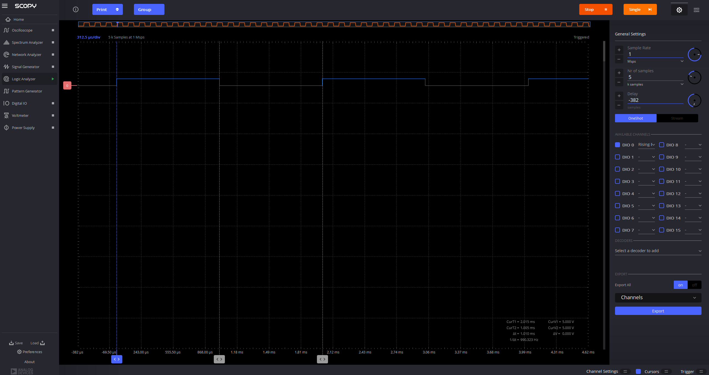
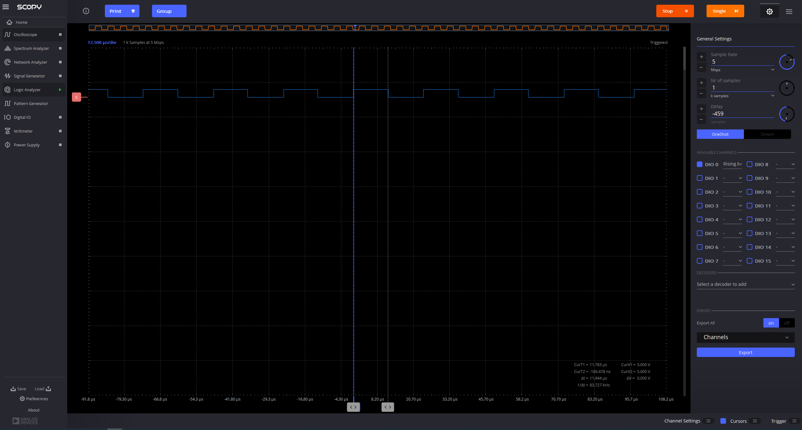

# Project 3: Measuring minimum delay in Arduino using the ADALM2000 logic analyzer

1. Understand the use of variables in code
2. Learn how to use a logic analyzer
3. Understand the concept of overhead and measure it

## resources
[Arduino Functions Reference](https://www.arduino.cc/reference/en/)

## Change Blink.ino code
 - Save Blink example as BlinkWithVariableDelay.ino in this folder
 - Use a variable to change built in led (13) to grove led (4)
 - Use a variable to change delay to 1 ms 
 - upload to arduino
 - can you see the led blink? Why?
 -- I cannot see the led blink, 1 ms is too fast.

## Use logic analyzer to see and measure the blink
 - connect ADALM2000 to grove kit: 
    - gnd in ADALM to GND in arduino (black color is used as a standard for GND)
    - digital pin 0 (solid pink) to pin13 in arduino (why?)
 - open scopy program
 - connect to ADALM2000
 - open scopy logic analyzer
 - activate DIO0 and rising edge and run (why?)
 -- this fixes the sampling to a specific point (the rising from 0 to 1), as opposed to the arbitrary starting point from when the device was connected.
 - play with the scopy parameters until you can see the separate blinks. Which parameter(s) do you need to change?
 -- I needed to change the number of samples to be able to see more fluctations.
 - use cursors and sample rate to measure the pulse width
 -- the pulse width (delta t) is approximaely 1.010 ms
 - take screenshots and add them to the README below.

## Measure overhead
 - Remove the delay statements and upload the code
 - Measure pulse width. What is the minimum time that the signal is HIGH and LOW? this is the overhead.
 -- approximately 3.8 micro-seconds
 - Take screenshots and add them to the README below.
 

## even shorter blink
- delay() is limited to 1 ms. Find a function that delays 1 microsecond. 
 - Try different delays and measure the overhead.
 -- overhead for 5 us: 6.840 us - 5 us = 1.840 us
 -- overhead for 10 us: 11.994 - 10 us = 1.994 us
 - Take screenshots and add them to the README below.

## Git
 - Commit the new README with your screenshots
 - push to your repo.

## Exercise
Paste screenshots below.

### delay in ms

### no delay

### delay of 5 us

### delays of 10 us
