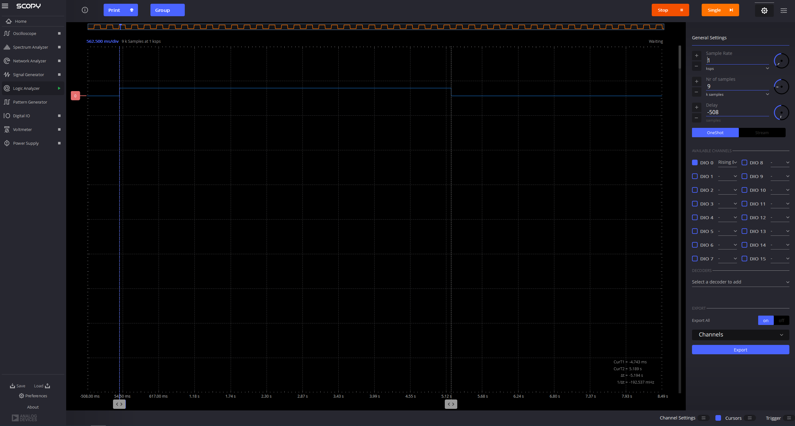
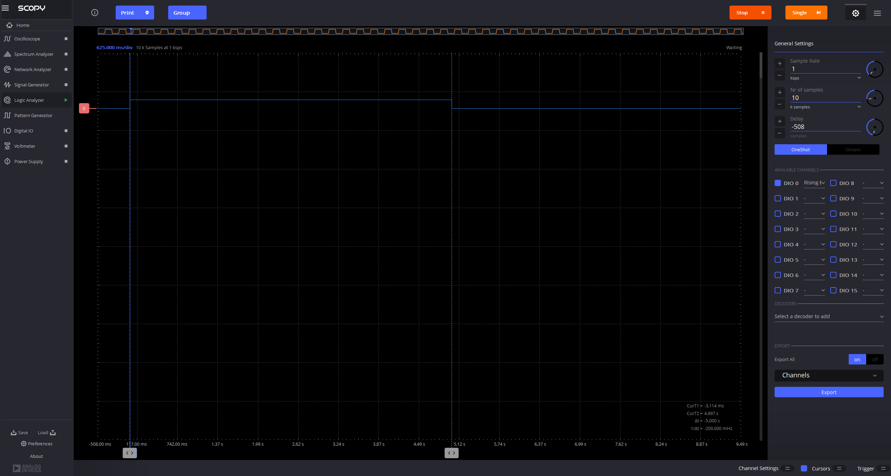
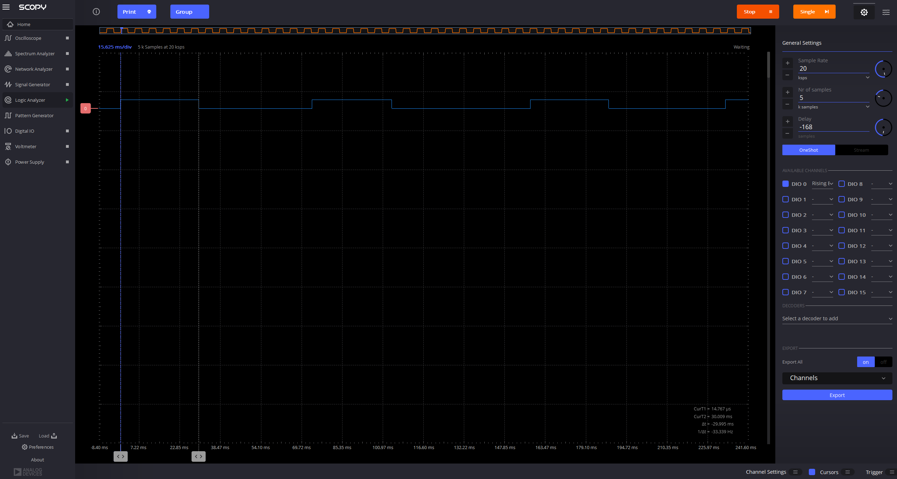

# Project 6: LED turns ON for 5 seconds on button press - the use of timers in Arduino

1. Understand the use of timers in Arduino and problems that they can solve

## Write a program that does the following:
- Turn on an LED on pin 4 when a button is pressed using interrupts
- The LED should turn off after 5 seconds
- Do not use a delay() function here. Please use the system clock to measure the time. look for the millis() function in the Arduino reference.
Test the code and make sure it works as expected
paste a screen shot from the logic analyzer below:

 
## update the code to add a delay in the loop function
- Add the same for loop as in the previous exercise to simulate a long process. Does the LED still turn off after 5 seconds? Why or why not?
answer here: ___The LED doesn't turn back off after 5 seconds because the calculation in the loop takes far more time, so it hasn't returned back to check the if statement quickly enough (~5 seconds); you can see from the screenshot from the logic analyzer that it took far longer than 5 seconds, around 20 or more seconds_______
add a screen shot from the logic analyzer below:

## Write a second program. The proper way to solve this problem is to use a timer
- install package mstimer2 from the library manager
- read the readme file of the package and note the package limitations
- open an example of the package, examine the code and its functions and how to use them.
- implement a timer to turn off the LED after 5 seconds
- note the callback in the timer. When is it called?
-- the callback in the timer, 'turnOffLED', is called every 5000 ms, or 5 seconds, to turn of the led.

## Exercises
- check that although the delay of 1 second is still in the loop function, the LED now turns off after 5 seconds
-- It turns off after 5s.

- change the LED time ON from 5 seconds to 30 ms, measure in the scope the time the LED is ON. is it 30 ms? Why or why not?
answer here: ____I measure 29.995 ms (no effect from delay because the timer is outside of the loop)______
paste a screen shot from the scope below:

(I pressed the button a few times)

