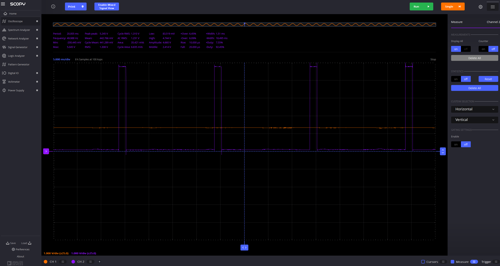

# Project7 - Analog!

1. Understand the difference between analog and digital signals
1. Learn to use a voltmeter and scope
1. Measure analog signals
1. Understand PWM and when to use it
1. Learn about MD_PWM package
1. Learn about servo motors
1. Understand arduino signal capabilities

## Adding a dimmer functionality to the LED

-- percentage/fraction, and frequency

The purpose of this project is to dim and increase the led light using the rotary button.

- rotary is A0 in Arduino. connect gnd (in arduino) first to orange with stripe (in ADALM) and then A0 to orange.
- Use voltmeter in Scopy to see range of values when turning the rotary. (you will need to create an Arduino file for this)
-- min: 0.002 V, max 4.811 V
- pin 4 (grove LED) is not supported for PWM. Install package MD_PWM, and set pin 4 to be PWM using the package documentation.
- Using the rotary value, update the PWM value. Note the range of values that can be used according to package documentation (0-255). Change your code accordingly (mapped 0-1023 to 0-255).
- test your code.
- View in scope: Connect Analog 2 (dark blue) to pin 4 in arduino (LED output). Play with the times and triggers until you see the PWM change when turning the rotary.
- View in voltmeter - stop scope first. See the average voltage change. What is the duty cycle?

-- the mean voltage (mean cycle change) is (currently) 1.265 V, and the duty cycle is ~7.55%
- what happens when using 30Hz instead of 50Hz for the PWM?
-- this is a slower frequency, and I can actually see the led flickering at lower PWM values

## Use PWM to control a servo motor

- connect analog 2 in adalm (dark blue) to digital 7 in arduino
- install Servo package if not already installed
- initialize Servo package with pin 7
- first check in adalm the range of the mapped values. What frequency is the Servo package using?
-- from the scope, the period is 20 ms, so the frequency is 50 Hz
- connect to servo using D7 breakout (ground on the left on the side of the led). connect plus to servo
- turn rotary to turn the servo
- How does the range of the servo motor compare to the range of the rotary? Use the scope.
-- the rotary ranges from the full available voltage, from 0 to 5 V, while the servo motor ranges within a duty of ~ 2-12% (it doesn't have even close to the same range as the rotary)
- is the range of our server the same as the range of the package? change the range of values to the servo accordingly.
-- it isn't. the package range is 0-180 degrees, however, the motor cannot rotate to the maximum rotary output. To fix this, I cut the maximum angle down until the device didn't attempt to rotate further, and this value was 164 degrees.

## Exercises

- commit and push both .ino files and their folders to your repository

